# Архитектура

## Главная страница

`GET /horoscope-promotions/get-current` - получение текущей активной акции

``` 
@startuml
actor User

User -> PromotionController : GET /horoscope-promotions/get-current
PromotionController -> PromotionService : getActivePromotion()
PromotionService -> PG : SELECT promotion WHERE status='active'
PG --> PromotionService : promotion

PromotionService -> HoroscopeService : getHoroscopes(promoId)
HoroscopeService -> PG : SELECT * FROM horoscope WHERE promotion_id=promoId
PG --> HoroscopeService : horoscopes

HoroscopeService --> PromotionService : horoscopes
PromotionService --> PromotionController : promo
PromotionController --> User : promo

@enduml
```

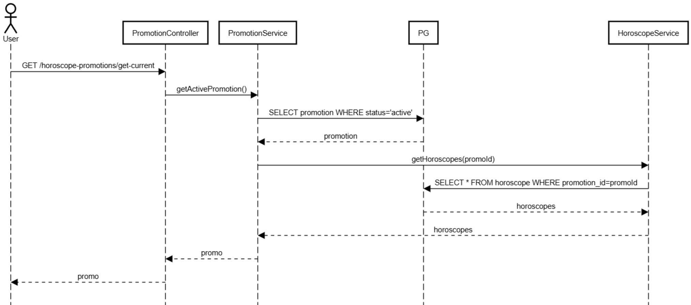

`GET /horoscope-promotions/promo/products/list` - получение продуктов гороскопа

```
@startuml
actor User

User -> HoroscopeController : GET /promo/products/list (promo_id, zodiac_id)

HoroscopeController -> HoroscopeService : getHoroscope(promoId, zodiacId)
HoroscopeService -> PG : SELECT * FROM horoscope WHERE promoId AND zodiacId
PG --> HoroscopeService : horoscope
HoroscopeService --> HoroscopeController : horoscope

HoroscopeController -> AuctionService : getAuctionWinners(horoscopeId)
AuctionService -> PG : SELECT FROM auction_winners
PG --> AuctionService : winners
AuctionService --> HoroscopeController : winnerProductIds

HoroscopeController -> ProductService : getProducts(ids)
ProductService -> PG : SELECT * FROM product WHERE id IN (...)
PG --> ProductService : products

ProductService --> HoroscopeController : products
HoroscopeController --> User : products

@enduml
```

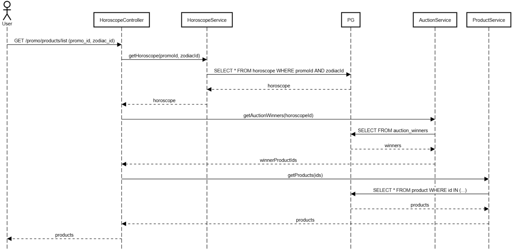

## Админка акции

Админ создает акцию и настраивает ее. Акция создается в статусе `NOT_READY`. Пока не заполнены
гороскопы и другие настройки, акция не может быть переведена в `READY_TO_START`

Статусы акций:

- NOT_READY
- READY_TO_START
- RUNNING
- PAUSED
- COMPLETED

`POST /horoscope-promotions/create` - создание новой акции

``` 
@startuml
actor Admin

Admin -> PromotionAdminController : POST /create (params)
PromotionAdminController -> PromotionService : createPromotion(params)
PromotionService -> PG : INSERT INTO promotion
PG --> PromotionService : id

PromotionService -> HoroscopeService : createHoroscopesForPromo()
HoroscopeService -> PG : INSERT INTO horoscope (...)
PG --> HoroscopeService

PromotionService -> PromotionAdminController : promo

PromotionAdminController -> Admin : promo
@enduml
```

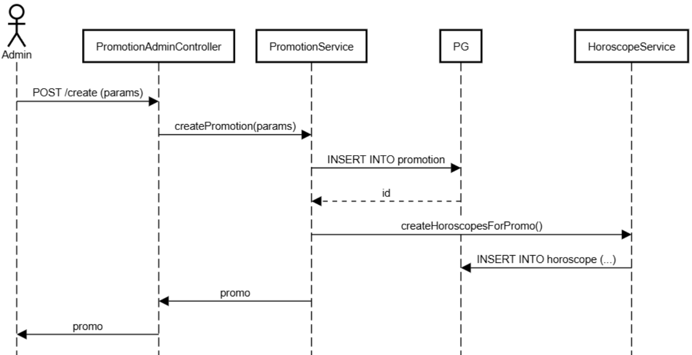

`GET /horoscope-promotions/get` - получение по id

``` 
@startuml
actor Admin

Admin -> PromotionAdminController : POST /get (params)
PromotionAdminController -> PromotionService : getPromotion(params)
PromotionService -> PG : SELECT FROM promotion
PG --> PromotionService : promo

PromotionService -> HoroscopeService : getHoroscopesByPromo()
HoroscopeService -> PG : SELECT FROM horoscope (...)
PG --> HoroscopeService

PromotionService -> PromotionAdminController : promo

PromotionAdminController -> Admin : promo
@enduml
```

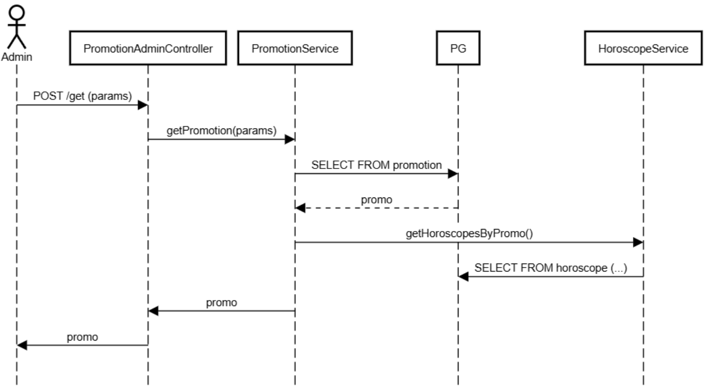

`UPDATE /horoscope-promotions/update` - обновление акции. Здесь же включение/выключение

``` 
@startuml
actor Admin

Admin -> PromotionAdminController : POST /update (params)
PromotionAdminController -> PromotionService : updatePromotion(params)
PromotionService -> PG : UPDATE promotion
PG --> PromotionService

PromotionService -> HoroscopeService : updateHoroscopes()
HoroscopeService -> PG : UPDATE horoscope
PG --> HoroscopeService

PromotionAdminController -> Admin : success
@enduml
```

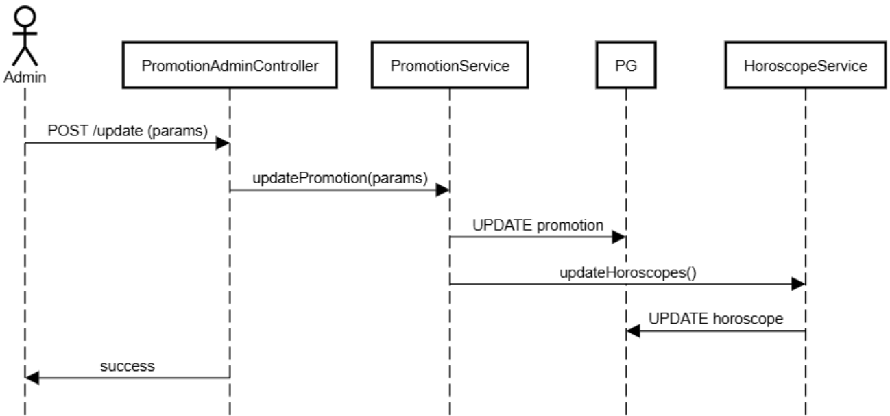

`POST /horoscope-promotions/delete` - удаление акции

``` 
@startuml
actor Admin

Admin -> PromotionAdminController : POST /delete (id)
PromotionAdminController -> PromotionService : deletePromotion(id)
PromotionService -> PG : UPDATE promotion SET deleted_at ...
PG --> PromotionService

PromotionAdminController -> Admin : success
@enduml
```

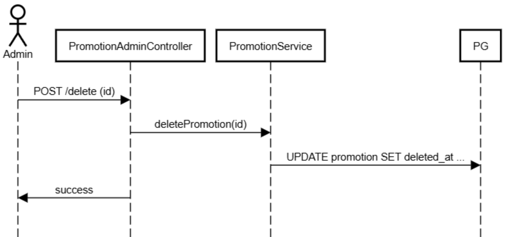

`POST /ai/get-text` - генерация текста в гороскоп

``` 
@startuml
actor Admin

Admin -> AIController : POST /ai/get-text (params)
AIController -> AIService : generateText(params)
AIService --> AIController : text

AIController -> HoroscopeService : updateHoroscopeText(text)
HoroscopeService -> PG : UPDATE horoscope SET text=...
PG --> HoroscopeService

AIController --> Admin : text
@enduml
```

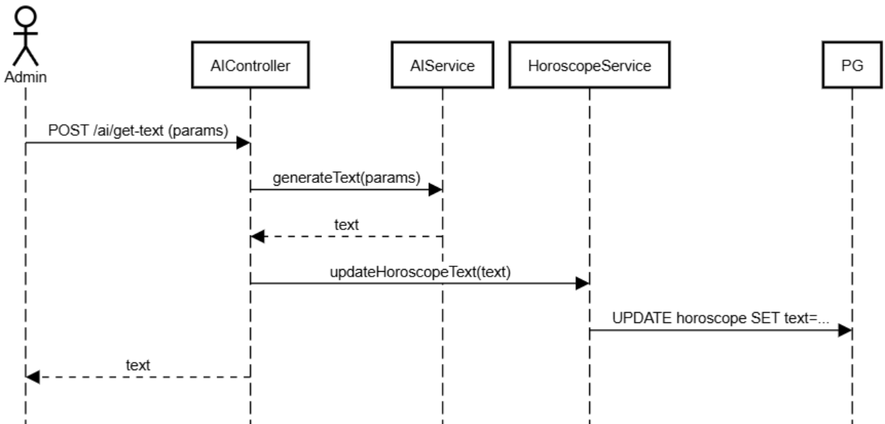

`POST /horoscope/products` - ручная установка товаров в гороскоп

``` 
@startuml
actor Admin

Admin -> PromotionAdminController : POST /horoscope/products (params)
PromotionAdminController -> AuctionService : setWinners (params)

AuctionService -> PG : INSERT INTO auction_winners ...

PromotionAdminController --> Admin : success
@enduml
```

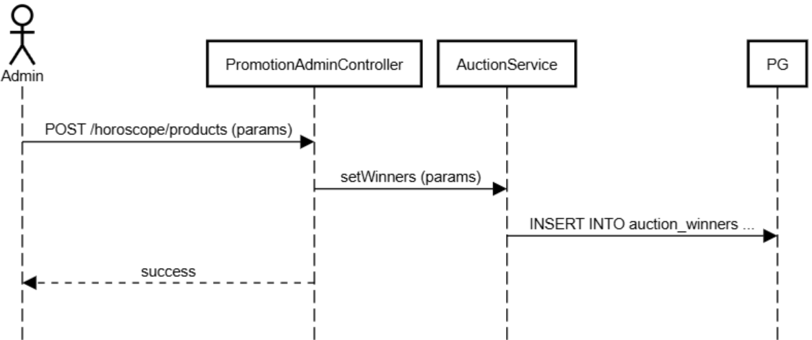

## Админка селлера

`GET /products/list-by` - список продуктов селлера

``` 
@startuml
actor Seller

Seller -> SellerProductController : GET /products/list-by (params)
SellerProductController -> ProductService : getSellerProducts(sellerId, categoryId)
ProductService -> PG : SELECT * FROM product WHERE seller_id=? AND category_id=?
PG --> ProductService : products

ProductService --> SellerProductController : products
SellerProductController --> Seller : products

@enduml
```

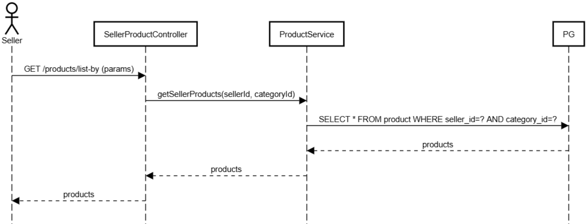

`GET /horoscope/list-pending-by-category-id/` - получить активные гороскопные аукционы, в которых может поучаствовать селлер

``` 
@startuml
actor Seller

Seller -> SellerHoroscopeController : GET /horoscope/list-pending-by-category-id (params)
SellerHoroscopeController -> HoroscopeService : getActiveByCategoryId
HoroscopeService -> PG : SELECT FROM horoscope WHERE ...
PG --> HoroscopeService : horoscopes

HoroscopeService --> SellerHoroscopeController : horoscopes
SellerHoroscopeController --> Seller : horoscopes

@enduml
```


`GET /seller/bets/list` - получить список ставок селлера

``` 
@startuml
actor Seller

Seller -> SellerSlotController : GET /seller/bets/list (params)
SellerSlotController -> AuctionService : getBets

AuctionService -> PG : SELECT FROM bet
PG --> AuctionService

PG-->AuctionService : bets

AuctionService --> SellerSlotController : bets
SellerSlotController --> Seller : bets

@enduml
```

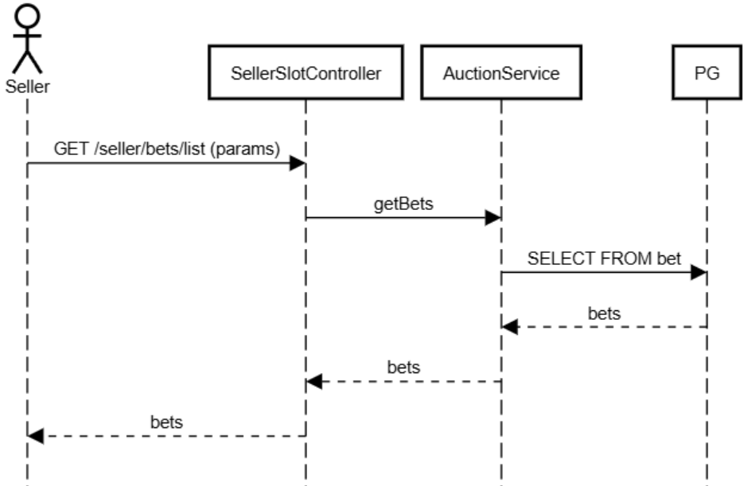

`POST /seller/bets/make` - поставить ставку

``` 
@startuml
actor Seller

Seller -> SellerSlotController : POST /seller/bets/make (params)
SellerSlotController -> AuctionService : placeBet

AuctionService -> PG : INSERT INTO bet
PG --> AuctionService

AuctionService -> KafkaProducer : publish(auction_changed)
KafkaProducer -> Kafka : send auction_changed

AuctionService --> SellerSlotController : bet_ok
SellerSlotController --> Seller : success

@enduml
```

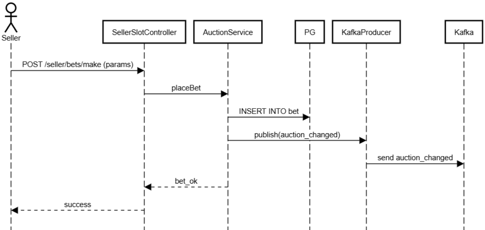

`POST /seller/bets/remove` - удалить ставку

``` 
@startuml
actor Seller

Seller -> SellerSlotController : GET /seller/bets/remove (params)
SellerSlotController -> AuctionService : removeBet

AuctionService -> PG : UPDATE bet SET deleted_at ...
PG --> AuctionService

PG-->AuctionService : bet

AuctionService --> SellerSlotController : bet
SellerSlotController --> Seller : bet

@enduml
```

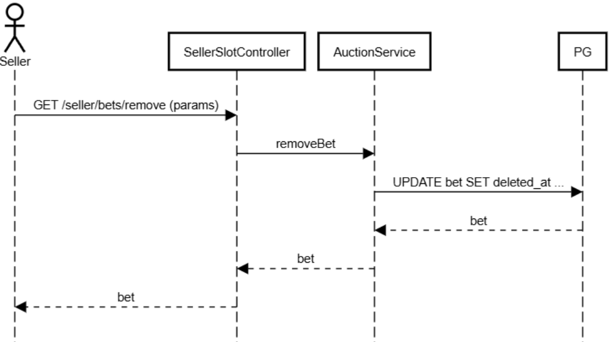